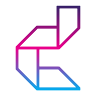
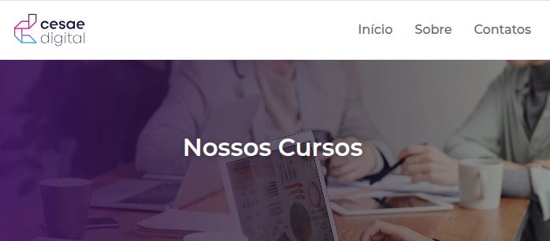
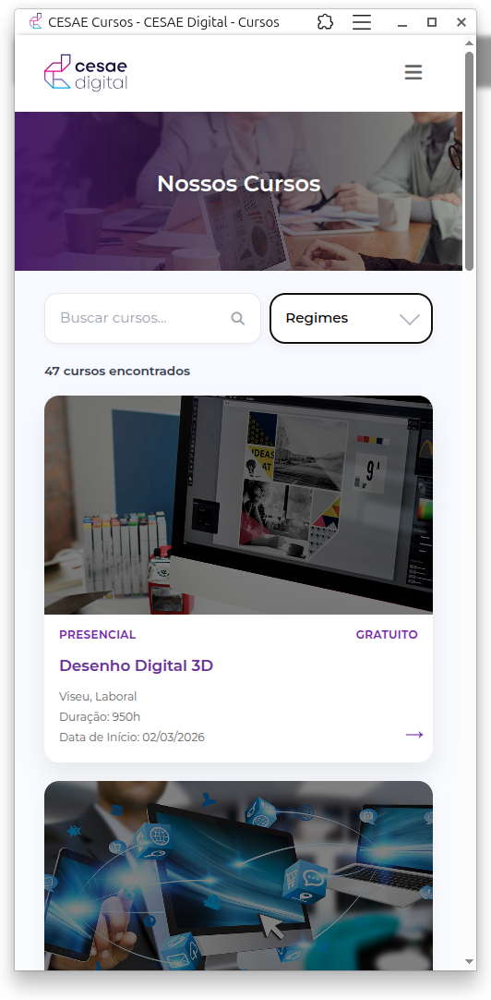
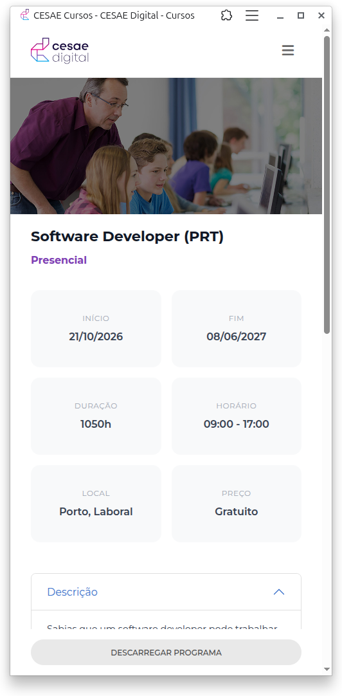
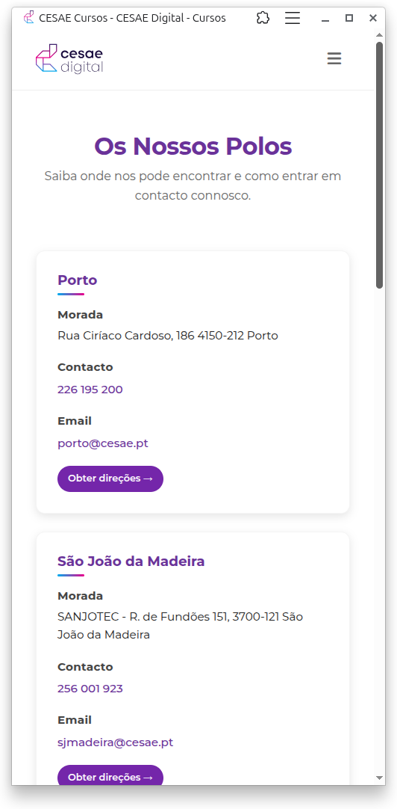

<a id="readme-top"></a>

[![MIT License][license-shield]][license-url]


<!-- PROJECT LOGO -->
<br />
<div align="center">
    <a href="https://github.com/cesae-dev-2025/CESAE_Courses/">
        
    </a>


  <p align="center">O CESAE promove transformação digital através de diversos cursos, que podem ser encontrados no seu site. No entanto, para tornar a oferta formativa mais acessível, desenvolvemos uma aplicação PWA que pode ser instalada em qualquer dicpositivo.</p>

[//]: # (  <p><a href="https://cesae-dev-2025.github.io/SmartTasks/"><strong>Veja a Demo</strong></a></p>)
</div>


<!-- TABLE OF CONTENTS -->
<details>
  <summary>Índice</summary>
  <ol>
    <li>
      <a href="#sobre-o-projecto">Sobre o Projecto</a>
      <ul>
        <li><a href="#caracteristicas">Características</a></li>
        <li><a href="#estrutura-do-projeto">Estrutura do projeto</a></li>
        <li><a href="#funcionalidades">Funcionalidades</a></li>
        <li><a href="#tecnologias-utilizadas">Tecnologias utilizadas</a></li>
        <li><a href="#capturas-de-ecrã">Capturas de ecrã</a></li>
      </ul>
    </li>
    <li>
      <a href="#como-utilizar">Como utilizar</a>
      <ul>
        <li><a href="#pré-requisitos">Pré-requisitos</a></li>
        <li><a href="#instalação">Instalação</a></li>
      </ul>
    </li>
    <li><a href="#roadmap">Roadmap</a></li>
    <li><a href="#licença">Licença</a></li>
    <li><a href="#contacto">Contacto</a></li>
    <li><a href="#agradecimentos">Agradecimentos</a></li>
  </ol>
</details>


<!-- ABOUT THE PROJECT -->

## Sobre o Projecto

<p align="center"></p>

### Características

- **Full-Stack TypeScript**: 'Type safety' entre cliente and servidor
- **Tipos partilhados**: Definição de tipos comuns partilhadas entre 'client' e 'server'
- **Etrutura Monorepo**: Organizado como um monorepo baseado em 'workspaces' com Turbo para build automatizado
- **Stack Moderna**:
    - [pnpm](https://pnpm.io/) como runtime e gestor de pacotes
    - [Hono](https://hono.dev) como framework backend
    - [Vite](https://vitejs.dev) para 'bundling' e 'hot-reloading' do frontend
    - [React](https://react.dev) para a UI do frontend moderna
    - [Playwright](https://playwright.dev/) como ferramenta de scraper para extrair dados dos cursos
    - [Turbo](https://turbo.build) para automatizar tarefas de build
- **PWA**: Experiência 'mobile-friendly' e capacidade de uso 'offline' com Progressive Web App (PWA)

### Estrutura do projeto

```
.
├── client/               # Frontend React
├── server/               # Backend Hono
├── shared/               # Definições TypeScript partilhadas
│   └── src/types/        # Definições de tipos (Type) usados tanto pelo 'client' como pelo 'server'
├── package.json          # package.json raiz, com 'workspaces'
└── turbo.json            # Configurações Turbo para 'build'
```

### Funcionalidades

- Listagem de cursos
- Buscar instantânea
- Filtro por regime do curso
- WebScraper para atualizar os cursos com base nos cursos disponíveis na página Web do CESAE
- Serviço de tarefa automatizado com 'cronjob' para execução automática do webscraper diariamente

### Tecnologias utilizadas

Este projeto foi desenvolvido com uso das tecnologias listadas abaixo.

<p align="center">
  
  
  
  
  
  
  
  
  
  
  
  
  
  
  
</p>

<p align="right">(<a href="#readme-top">voltar ao topo</a>)</p>

### Capturas de ecrã

<p>
  
    &nbsp;&nbsp;&nbsp;
  
</p>

<p>
  
    &nbsp;&nbsp;&nbsp;
  
</p>

<p align="right">(<a href="#readme-top">voltar ao topo</a>)</p>


<!-- GETTING STARTED -->

## Como utilizar

Para utilizar este projeto, basta clonar o repositório, garantir que tem os pré-requisitos instalados e seguir as instruções abaixo.

### Pré-requisitos

É preciso ter o instalados o Git e o Node.js (versão 20 ou superior).

### Instalação

1. Clone o repositório
   ```sh
   git clone https://github.com/CESAE-Dev-2025/CESAE_Courses.git
   ```
2. Modifique a URL do git remote para evitar `pushes` acidentais para o projeto base
   ```sh
   git remote set-url origin github_username/repo_name
   git remote -v # confirma as alterações
   ```
3. Instale as dependências na raiz do repositório
   ```sh
   pnpm install
   ```
4. Certifique de ter o plywright instalado no projeto server
   ```sh
   cd server
   npx plywright install --force
   cd ..
   ```
5. Inicie os projetos (`client` e `server`)
   ```sh
   pnpm dev
   ```
6. Para iniciar apenas um dos projetos, adicione um filtro ao comando acima,
   ```sh
   pnpm dev:client
   pnpm dev:server
   ```

<p align="right">(<a href="#readme-top">voltar ao topo</a>)</p>


<!-- ROADMAP -->

## Roadmap

- [ ] Adicionar mais filtros
- [ ] Revisar funcionalidades offline
- [ ] Revisar 'componentização' do frontend

Veja os ['issues' abertos](https://github.com/cesae-dev-2025/CESAE_Courses/issues) para obter uma lista completa e
atualizadas das funcionalidades propostas e bugs conhecidos.

<p align="right">(<a href="#readme-top">voltar ao topo</a>)</p>


<!-- LICENSE -->

## Licença

Distribuido sob a Licença MIT. veja `LICENSE.txt` para mais informações.

<p align="right">(<a href="#readme-top">voltar ao topo</a>)</p>


<!-- CONTACT -->

## Contacto

<ul>
    <li>Arícia Lima<br/>
        <a href = "https://github.com/AriciaLima" target="_blank"></a>
        <a href = "https://www.linkedin.com/in/ariciafariaslima/" target="_blank"></a>
    </li>
    <li>Leandro Gabriel<br/>
        <a href = "https://github.com/lassisg" target="_blank"></a>
        <a href = "https://www.linkedin.com/in/leandro-assis-gabriel/" target="_blank"></a>
    </li>
    <li>Sandro Draeger<br/>
        <a href = "https://github.com/Sandro-Draeger" target="_blank"></a>
        <a href = "https://www.linkedin.com/in/sandrodraeger/" target="_blank"></a>
    </li>
</ul>


Link do Projeto: [https://github.com/CESAE-Dev-2025/CESAE_Courses](https://github.com/CESAE-Dev-2025/CESAE_Courses)

<p align="right">(<a href="#readme-top">voltar ao topo</a>)</p>


<!-- ACKNOWLEDGMENTS -->

## Agradecimentos

Agradeçemos ao [CESAE](https://cesaedigital.pt/fldrSite/default.aspx) pela oportunidade de crescimento e
à [Vitor Santos](https://github.com/Vmvs007) por todo o apoio e suporte durante o desenvolvimento deste projeto e de outros.

Agradeço também aos mantenedores dos projetos listados abaixo:

* [Choose an Open Source License](https://choosealicense.com)
* [Best README Template](https://github.com/othneildrew/Best-README-Template)
* [Img Shields](https://shields.io)

<p align="right">(<a href="#readme-top">voltar ao topo</a>)</p>


<!-- MARKDOWN LINKS & IMAGES -->
<!-- https://www.markdownguide.org/basic-syntax/#reference-style-links -->

[product-screenshot]: ./images/screenshot_cover.png

[license-shield]: https://img.shields.io/github/license/CESAE-Dev-2025/SmartTasks.svg?style=for-the-badge

[license-url]: https://github.com/CESAE-Dev-2025/CESAE_Courses/blob/master/LICENSE

[linkedin-shield]: https://img.shields.io/badge/-LinkedIn-black.svg?style=for-the-badge&logo=linkedin&colorB=blue

[linkedin-url]: https://linkedin.com/in/leandro-assis-gabriel

[github-jose-url]:https://github.com/josepinho22

[github-leandro-url]:https://github.com/lassisg

[github-ricardo-url]:https://github.com/RicardoBu

[HTML5]: https://img.shields.io/badge/HTML5-E34F26?style=for-the-badge&logo=html5&logoColor=white

[HTML5-url]: https://developer.mozilla.org/pt-BR/docs/Web/HTML

[CSS3]: https://img.shields.io/badge/CSS3-1572B6?style=for-the-badge&logo=css3&logoColor=white

[CSS3-url]: https://developer.mozilla.org/pt-BR/docs/Web/HTML

[Bootstrap.com]: https://img.shields.io/badge/Bootstrap-563D7C?style=for-the-badge&logo=bootstrap&logoColor=white

[Bootstrap-url]: https://getbootstrap.com

[Javascript]: https://img.shields.io/badge/JavaScript-F7DF1E?style=for-the-badge&logo=javascript&logoColor=black

[Javascript-url]: https://developer.mozilla.org/pt-BR/docs/Web/JavaScript
